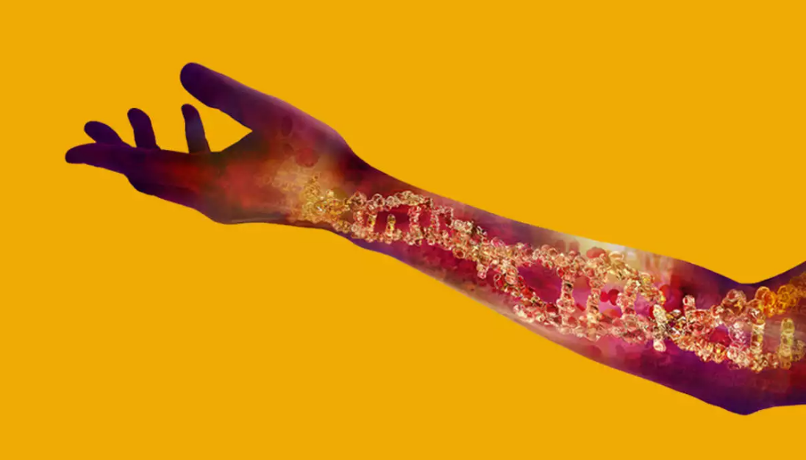

**Information on Clinical Trial Protocol Template**

This protocol template has been designed primarily for Clinical Trials which
require a Clinical Trial Certificate (CTC) from HSA. Please refer to the
Medicines Act for the legislative definition of clinical trial (see Section 2 of
the Act, Interpretation) and medicinal product (Section 3). A CTC is not only
required for unregistered medicinal products, but also for clinical trials on
locally registered medicinal products.

This template serves as a guide for all investigators. However, it is not
mandatory to use this template, provided that an alternative GCP-compliant
protocol is used. All advisory text is highlighted. These should all be deleted
before finalising the document. All sample text is in ‘basic text’ style.

**CLINICAL TRIAL PROTOCOL**

| **PROTOCOL TITLE:**                                   |                            |
|-------------------------------------------------------|----------------------------|
| INSERT PROTOCOL TITLE HERE                            |                            |
|                                                       |                            |
| **PROTOCOL NUMBER:**                                  |                            |
| INSERT PROTOCOL NUMBER HERE                           |                            |
|                                                       |                            |
| **PROTOCOL VERSION:**                                 | Insert Version Number Here |
| **PROTOCOL DATE:**                                    | Insert Version Date Here   |
|                                                       |                            |
| **PRINCIPAL INVESTIGATOR:**                           |                            |
| Insert PI Name, Designation, Institution Here         |                            |
|                                                       |                            |
| **SITE PRINCIPAL INVESTIGATOR:**                      |                            |
| Insert PI Name, Designation, Institution Here         |                            |
| Insert PI Name, Designation, Institution Here         |                            |
|                                                       |                            |
| **CO-INVESTIGATORS:**                                 |                            |
| Insert Co-Investigator Name, Designation, Institution |                            |
| Insert Co-Investigator Name, Designation, Institution |                            |
| Insert Co-Investigator Name, Designation, Institution |                            |
| Insert Co-Investigator Name, Designation, Institution |                            |
| **COLLABORATORS:**                                    |                            |
| Insert Collaborator Name, Designation, Institution    |                            |
| Insert Collaborator Name, Designation, Institution    |                            |
| Insert Collaborator Name, Designation, Institution    |                            |
| Insert Collaborator Name, Designation, Institution    |                            |

Table of Contents
=================

[1 BACKGROUND AND RATIONALE 5](#background-and-rationale)

[1.1 General Introduction 5](#general-introduction)

[1.2 Rationale and Justification for the Study
5](#rationale-and-justification-for-the-study)

[1.2.1 Rationale for the Study Purpose 5](#rationale-for-the-study-purpose)

[1.2.2 Rationale for Doses Selected 5](#rationale-for-doses-selected)

[1.2.3 Rationale for Study Population 5](#rationale-for-study-population)

[1.2.4 Rationale for Study Design 5](#rationale-for-study-design)

[2 HYPOTHESIS AND OBJECTIVES 5](#hypothesis-and-objectives)

[2.1 Hypothesis 5](#hypothesis)

[2.2 Primary Objectives 6](#primary-objectives)

[2.3 Secondary Objectives 6](#secondary-objectives)

[2.4 Potential Risks and Benefits: 6](#potential-risks-and-benefits)

[2.4.1 Potential Risks 6](#potential-risks)

[2.4.2 Potential Benefits 6](#potential-benefits)

[3 STUDY POPULATION 6](#study-population)

[3.1 List The Number and nature of Subjects to be Enrolled.
6](#list-the-number-and-nature-of-subjects-to-be-enrolled.)

[3.2 Criteria for Recruitment and Recruitment Process
6](#criteria-for-recruitment-and-recruitment-process)

[3.3 Inclusion Criteria 6](#inclusion-criteria)

[3.4 Exclusion Criteria 7](#exclusion-criteria)

[3.5 Subject Replacement 7](#subject-replacement)

[4 STUDY DESIGN 7](#study-design)

[4.1 Randomisation and Blinding 7](#randomisation-and-blinding)

[4.2 Contraception and Pregnancy Testing
7](#contraception-and-pregnancy-testing)

[4.3 Study Visits and Procedures 7](#study-visits-and-procedures)

[4.3.1 Screening Visits and Procedures 8](#screening-visits-and-procedures)

[4.3.2 Study Visits and Procedures 8](#study-visits-and-procedures-1)

[4.3.3 Final Study Visit: 8](#final-study-visit)

[4.3.4 Post Study Follow up and Procedures
8](#post-study-follow-up-and-procedures)

[4.4 Discontinuation/Withdrawal 8](#discontinuationwithdrawal)

[4.4.1 Discontinuation Criteria 8](#discontinuation-criteria)

[4.4.2 Discontinuation Visit and Procedures
8](#discontinuation-visit-and-procedures)

[5 TRIAL MATERIALS 8](#trial-materials)

[5.1 Trial Product (s) 9](#trial-product-s)

[5.2 Storage and Drug Accountability 9](#storage-and-drug-accountability)

[6 TREATMENT 9](#treatment)

[6.1 Rationale for Selection of Dose 9](#rationale-for-selection-of-dose)

[6.2 Study Drug Formulations 9](#study-drug-formulations)

[6.3 Study Drug Administration 9](#study-drug-administration)

[6.4 Specific Restrictions / Requirements
9](#specific-restrictions-requirements)

[6.5 Blinding 9](#blinding)

[6.6 Concomitant therapy 9](#concomitant-therapy)

[7 SAFETY MEASUREMENTS 10](#safety-measurements)

[7.1 Definitions 10](#definitions)

[7.2 Collecting, Recording and Reporting of Adverse Events and Serious Adverse
Events to CIRB
10](#collecting-recording-and-reporting-of-adverse-events-and-serious-adverse-events-to-cirb)

[7.3 Collecting, Recording and Reporting of Serious Adverse Events (SAEs) to the
Health Science Authority (HSA)
11](#collecting-recording-and-reporting-of-serious-adverse-events-saes-to-the-health-science-authority-hsa)

[7.4 Safety Monitoring Plan 11](#safety-monitoring-plan)

[7.5 Complaint Handling 11](#complaint-handling)

[8 DATA ANALYSIS 11](#data-analysis)

[8.1 Data Quality Assurance 11](#data-quality-assurance)

[8.2 Data Entry and Storage 11](#data-entry-and-storage)

[9 SAMPLE SIZE AND STATISTICAL METHODS 11](#sample-size-and-statistical-methods)

[9.1 Determination of Sample Size 11](#determination-of-sample-size)

[9.2 Statistical and Analytical Plans 11](#statistical-and-analytical-plans)

[10 DIRECT ACCESS TO SOURCE DATA/DOCUMENTS
12](#direct-access-to-source-datadocuments)

[11 QUALITY CONTROL AND QUALITY ASSURANCE
12](#quality-control-and-quality-assurance)

[12 ETHICAL CONSIDERATIONS 12](#ethical-considerations)

[12.1 Informed Consent 12](#informed-consent)

[12.2 Confidentiality of Data and Patient Records
13](#confidentiality-of-data-and-patient-records)

[13 PUBLICATIONS 13](#publications)

[14 RETENTION OF TRIAL DOCUMENTS 13](#retention-of-trial-documents)

[15 FUNDING and INSURANCE 13](#funding-and-insurance)

**PROTOCOL SIGNATURE PAGE**

Protocol Title:

Protocol Number:

Protocol Version/ Date:

Sponsor Name:

*Declaration of Investigator*

I confirm that I have read the above-mentioned protocol and its attachments. I
agree to conduct the described trial in compliance with all stipulations of the
protocol, regulations and Singapore Guideline for Good Clinical Practice
(SGGCP).

| Principal Investigator Name:  \_________________________________________\_ Principal Investigator Signature:  \______________________________________\_ Date:  \_________________________________________\_ |
|-------------------------------------------------------------------------------------------------------------------------------------------------------------------------------------------------------------|
| **BACKGROUND AND RATIONALE**                                                                                                                                                                                |

>   Briefly sketch the background to the current proposal, critically evaluating
>   the existing knowledge and specifically identify the gaps that the project
>   is intended to fill. Describe findings from non-clinical studies and other
>   clinical studies that are relevant to the study. If applicable, reference to
>   literature and data that are relevant to the study.

|                                                                                                                                                                                                                                                                                                                                                                                                                                                                                                                                 |   |
|---------------------------------------------------------------------------------------------------------------------------------------------------------------------------------------------------------------------------------------------------------------------------------------------------------------------------------------------------------------------------------------------------------------------------------------------------------------------------------------------------------------------------------|---|
| General Introduction                                                                                                                                                                                                                                                                                                                                                                                                                                                                                                            |   |
|                                                                                                                                                                                                                                                                                                                                                                                                                                                                                                                                 |   |
| Rationale and Justification for the Study                                                                                                                                                                                                                                                                                                                                                                                                                                                                                       |   |
|                                                                                                                                                                                                                                                                                                                                                                                                                                                                                                                                 |   |
| Rationale for the Study Purpose                                                                                                                                                                                                                                                                                                                                                                                                                                                                                                 |   |
| Briefly sketch the background to the current proposal, critically evaluate existing knowledge and specifically identify the gaps that the project is intended to fill.                                                                                                                                                                                                                                                                                                                                                          |   |
| Rationale for Doses Selected                                                                                                                                                                                                                                                                                                                                                                                                                                                                                                    |   |
| Briefly sketch the rationale for selection of the study dosage.                                                                                                                                                                                                                                                                                                                                                                                                                                                                 |   |
| Rationale for Study Population                                                                                                                                                                                                                                                                                                                                                                                                                                                                                                  |   |
| Justify selection of target population.                                                                                                                                                                                                                                                                                                                                                                                                                                                                                         |   |
| Rationale for Study Design                                                                                                                                                                                                                                                                                                                                                                                                                                                                                                      |   |
| State the rationale behind the proposed study design (e.g. two period cross over, case control etc.)                                                                                                                                                                                                                                                                                                                                                                                                                            |   |
|                                                                                                                                                                                                                                                                                                                                                                                                                                                                                                                                 |   |
| **HYPOTHESIS AND OBJECTIVES**                                                                                                                                                                                                                                                                                                                                                                                                                                                                                                   |   |
|                                                                                                                                                                                                                                                                                                                                                                                                                                                                                                                                 |   |
| Hypothesis                                                                                                                                                                                                                                                                                                                                                                                                                                                                                                                      |   |
| State concisely what hypothesis is to be tested.                                                                                                                                                                                                                                                                                                                                                                                                                                                                                |   |
| Primary Objectives                                                                                                                                                                                                                                                                                                                                                                                                                                                                                                              |   |
| State primary protocol objective. This should always address a specific hypothesis.                                                                                                                                                                                                                                                                                                                                                                                                                                             |   |
| Secondary Objectives                                                                                                                                                                                                                                                                                                                                                                                                                                                                                                            |   |
|                                                                                                                                                                                                                                                                                                                                                                                                                                                                                                                                 |   |
| Potential Risks and Benefits:                                                                                                                                                                                                                                                                                                                                                                                                                                                                                                   |   |
| Potential Risks                                                                                                                                                                                                                                                                                                                                                                                                                                                                                                                 |   |
| Include a discussion of anticipated risks.                                                                                                                                                                                                                                                                                                                                                                                                                                                                                      |   |
| Potential Benefits                                                                                                                                                                                                                                                                                                                                                                                                                                                                                                              |   |
| Include a discussion of anticipated benefits.                                                                                                                                                                                                                                                                                                                                                                                                                                                                                   |   |
|                                                                                                                                                                                                                                                                                                                                                                                                                                                                                                                                 |   |
| **STUDY POPULATION**                                                                                                                                                                                                                                                                                                                                                                                                                                                                                                            |   |
| List The Number and Nature of Subjects to be Enrolled.                                                                                                                                                                                                                                                                                                                                                                                                                                                                          |   |
| Give a breakdown by institution for multi centre studies within Singapore. Indicate from where the study population will be drawn. State if there are any subject restrictions based on race of the subject. Justify the exclusion of women, children or minorities if the study tends to exclude them in context of the study design.                                                                                                                                                                                          |   |
| Criteria for Recruitment and Recruitment Process                                                                                                                                                                                                                                                                                                                                                                                                                                                                                |   |
| Discuss evaluations/procedures necessary to assess or confirm whether a subject meets the eligibility criteria and may be enrolled. Describe the process of recruitment.                                                                                                                                                                                                                                                                                                                                                        |   |
| Inclusion Criteria                                                                                                                                                                                                                                                                                                                                                                                                                                                                                                              |   |
| Provide a statement that subject must meet all of the inclusion criteria to participate in this study and list each criterion.                                                                                                                                                                                                                                                                                                                                                                                                  |   |
| Exclusion Criteria                                                                                                                                                                                                                                                                                                                                                                                                                                                                                                              |   |
| Provide a statement that all subjects meeting any of the exclusion criteria at baseline will be excluded from participation and then list the criterion.                                                                                                                                                                                                                                                                                                                                                                        |   |
| Subject Replacement                                                                                                                                                                                                                                                                                                                                                                                                                                                                                                             |   |
| State whether subjects who drop out will be replaced.                                                                                                                                                                                                                                                                                                                                                                                                                                                                           |   |
| **STUDY DESIGN**                                                                                                                                                                                                                                                                                                                                                                                                                                                                                                                |   |
| Discuss in detail the experimental design (e.g. two period crossover, case control, placebo control, blinding, randomization, number of study arms, phase of trial, approximate time to complete study recruitment, expected duration of subject participation, sequence and duration of all trial periods, including follow up, changes in scheduling, single or multi centre, healthy or sick population, in or outpatient etc.) to accomplish the specific aims of the project. Use diagrams to explain design complexities. |   |
| Will any of the procedures be placed on the audiotape, film / video, or other electronic medium? If yes, what is the medium? Explain how the recorded information will be used? How long will the tapes etc. Be retained and how will they be disposed off?                                                                                                                                                                                                                                                                     |   |
| Randomisation and Blinding                                                                                                                                                                                                                                                                                                                                                                                                                                                                                                      |   |
| This section should describe randomisation and blinding procedures (if applicable to the study design). Include a description or a table that describes how study subjects will be assigned to the study groups. The timing and procedures for planned and unplanned breaking of randomization codes should be included. Include statement when unmasking may occur and who may unmask.                                                                                                                                         |   |
| Contraception and Pregnancy Testing                                                                                                                                                                                                                                                                                                                                                                                                                                                                                             |   |
| For females of childbearing age included in the trial describe methods of pregnancy testing and contraception if pregnancy is to be avoided during the trial.                                                                                                                                                                                                                                                                                                                                                                   |   |
| Study Visits and Procedures                                                                                                                                                                                                                                                                                                                                                                                                                                                                                                     |   |
| Provide a brief outline of the all the study visits, procedures to be done during the study, follow up after the study and discontinuation visit.                                                                                                                                                                                                                                                                                                                                                                               |   |
| Screening Visits and Procedures                                                                                                                                                                                                                                                                                                                                                                                                                                                                                                 |   |
| Include only those evaluations necessary to assess whether a subject meets recruitment criteria. Discuss the sequence of events that should occur during screening and the decision points regarding eligibility. List the timeframe prior to recruitment within which screening tests and evaluations must be done (e.g. within 28 days prior to recruitment). Describe all procedures that must be completed before the study begins.                                                                                         |   |
| Study Visits and Procedures                                                                                                                                                                                                                                                                                                                                                                                                                                                                                                     |   |
| Describe all the visits and procedures that must be performed during the study intervention phase.                                                                                                                                                                                                                                                                                                                                                                                                                              |   |
| Final Study Visit:                                                                                                                                                                                                                                                                                                                                                                                                                                                                                                              |   |
| Define when the final study visit should occur and any special procedures / evaluations or instructions to the subject.                                                                                                                                                                                                                                                                                                                                                                                                         |   |
| Post Study Follow up and Procedures                                                                                                                                                                                                                                                                                                                                                                                                                                                                                             |   |
| Include discussion of evaluations/procedures required to assess or confirm study outcome measures and study evaluations. Discuss the sequence of events that should occur during the visit, if applicable. Include, as applicable, counselling, medications, assessment of adverse events etc.                                                                                                                                                                                                                                  |   |
| Discontinuation/Withdrawal                                                                                                                                                                                                                                                                                                                                                                                                                                                                                                      |   |
| **TRIAL MATERIALS**                                                                                                                                                                                                                                                                                                                                                                                                                                                                                                             |   |
| If multiple products are to be evaluated in the study, the following sections should be repeated for each product and the sections should be renumbered accordingly. Describe placebo or control product.                                                                                                                                                                                                                                                                                                                       |   |
| Trial Product (s)                                                                                                                                                                                                                                                                                                                                                                                                                                                                                                               |   |
| Please provide background information on the trial product, its safety issues and duration of exposure. For drugs also include information on dosage.                                                                                                                                                                                                                                                                                                                                                                           |   |
| Storage and Drug Accountability                                                                                                                                                                                                                                                                                                                                                                                                                                                                                                 |   |
| Describe product’s storage needs. Include storage requirements and stability (temperature, humidity, security and container).                                                                                                                                                                                                                                                                                                                                                                                                   |   |
|                                                                                                                                                                                                                                                                                                                                                                                                                                                                                                                                 |   |
| **TREATMENT**                                                                                                                                                                                                                                                                                                                                                                                                                                                                                                                   |   |
| Rationale for Selection of Dose                                                                                                                                                                                                                                                                                                                                                                                                                                                                                                 |   |
| Clearly explain the rationale for the dose used during the study.                                                                                                                                                                                                                                                                                                                                                                                                                                                               |   |
| Study Drug Formulations                                                                                                                                                                                                                                                                                                                                                                                                                                                                                                         |   |
| Describe in what form the study drug will be dispensed to the subjects.                                                                                                                                                                                                                                                                                                                                                                                                                                                         |   |
| Study Drug Administration                                                                                                                                                                                                                                                                                                                                                                                                                                                                                                       |   |
| Describe the drug regimen to be used. State any special precautions or warnings relevant for the study drug administration.                                                                                                                                                                                                                                                                                                                                                                                                     |   |
| Specific Restrictions / Requirements                                                                                                                                                                                                                                                                                                                                                                                                                                                                                            |   |
| Indicate any limitations on medications, herbs, vitamins and mineral supplements (other than study agents) while participating in the study. Include time periods if applicable.                                                                                                                                                                                                                                                                                                                                                |   |
| Blinding                                                                                                                                                                                                                                                                                                                                                                                                                                                                                                                        |   |
| If applicable describe the measures that will be undertaken to blind the study participants and/or study staff from participant treatment assignments.  State when unblinding is expected and if/when participants will be told their assignments. Note plans to handle early unblinding to protect participant safety, if any.                                                                                                                                                                                                 |   |
| Concomitant therapy                                                                                                                                                                                                                                                                                                                                                                                                                                                                                                             |   |
| All medications (prescription and over the counter), vitamin and mineral supplements, and / or herbs taken by the participant should be documented.                                                                                                                                                                                                                                                                                                                                                                             |   |
|                                                                                                                                                                                                                                                                                                                                                                                                                                                                                                                                 |   |
| **SAFETY MEASUREMENTS**                                                                                                                                                                                                                                                                                                                                                                                                                                                                                                         |   |
| Definitions                                                                                                                                                                                                                                                                                                                                                                                                                                                                                                                     |   |
| An adverse event (AE) is any untoward medical occurrence in a patient or clinical investigation subject administered a pharmaceutical product and which does not necessarily have a causal relationship with this treatment.                                                                                                                                                                                                                                                                                                    |   |
| Collecting, Recording and Reporting of Adverse Events and Serious Adverse Events to CIRB                                                                                                                                                                                                                                                                                                                                                                                                                                        |   |
| Reporting of adverse events involves the PI submitting to the approving CIRB the completed SAE Reporting Form within the stipulated timeframe. PI is responsible for informing the institution representative (local SAE resulting in death), sponsor or regulatory bodies as required and appropriate.                                                                                                                                                                                                                         |   |
| Collecting, Recording and Reporting of Serious Adverse Events (SAEs) to the Health Science Authority (HSA)                                                                                                                                                                                                                                                                                                                                                                                                                      |   |
| All SAEs that are unexpected and related to the study drug will be reported to HSA. All SAEs will be reported to HSA according to the HSA Guidance for Industry “Safety Reporting Requirements for Clinical Drug Trials.”                                                                                                                                                                                                                                                                                                       |   |
| Safety Monitoring Plan                                                                                                                                                                                                                                                                                                                                                                                                                                                                                                          |   |
| Please include details on the Data Safety Monitoring Plan (DSMP) for the research study. Please discuss the plans in place to ensure the safety and well being of subjects, and integrity of data collected.                                                                                                                                                                                                                                                                                                                    |   |
| Complaint Handling                                                                                                                                                                                                                                                                                                                                                                                                                                                                                                              |   |
| Briefly discuss how complaints will be handled.                                                                                                                                                                                                                                                                                                                                                                                                                                                                                 |   |
|                                                                                                                                                                                                                                                                                                                                                                                                                                                                                                                                 |   |
| **DATA ANALYSIS**                                                                                                                                                                                                                                                                                                                                                                                                                                                                                                               |   |
| Data Quality Assurance                                                                                                                                                                                                                                                                                                                                                                                                                                                                                                          |   |
| Discuss the measures undertaken to ensure that the data obtained from this research is accurate, complete and reliable.                                                                                                                                                                                                                                                                                                                                                                                                         |   |
| Data Entry and Storage                                                                                                                                                                                                                                                                                                                                                                                                                                                                                                          |   |
| Briefly discuss where data will be entered (i.e. will these entries be on paper or electronically), stored and handled.                                                                                                                                                                                                                                                                                                                                                                                                         |   |
|                                                                                                                                                                                                                                                                                                                                                                                                                                                                                                                                 |   |
| **SAMPLE SIZE AND STATISTICAL METHODS**                                                                                                                                                                                                                                                                                                                                                                                                                                                                                         |   |
| Determination of Sample Size                                                                                                                                                                                                                                                                                                                                                                                                                                                                                                    |   |
| Details on sample size calculation and the means by which data will be analysed and interpreted.                                                                                                                                                                                                                                                                                                                                                                                                                                |   |
| Statistical and Analytical Plans                                                                                                                                                                                                                                                                                                                                                                                                                                                                                                |   |
| General Considerations                                                                                                                                                                                                                                                                                                                                                                                                                                                                                                          |   |
| Safety Analyses                                                                                                                                                                                                                                                                                                                                                                                                                                                                                                                 |   |
| Interim Analyses                                                                                                                                                                                                                                                                                                                                                                                                                                                                                                                |   |
| **DIRECT ACCESS TO SOURCE DATA/DOCUMENTS**                                                                                                                                                                                                                                                                                                                                                                                                                                                                                      |   |
| Informed Consent                                                                                                                                                                                                                                                                                                                                                                                                                                                                                                                |   |
| Describe the procedures for obtaining and documenting informed consent of study subjects. Make provision for special populations e.g. non English speakers, children, illiterate or non-writing individuals, vulnerable populations. In obtaining and documenting informed consent, the investigator should comply with the SGGCP guidelines and to the ethical principles that have their origin in the Declaration of Helsinki. Please specify when consent will be taken and who will take consent.                          |   |
| Confidentiality of Data and Patient Records                                                                                                                                                                                                                                                                                                                                                                                                                                                                                     |   |
| Include procedures for maintaining subject confidentiality, any special data security requirements, and record retention. This confidentiality is extended to cover testing of biological samples and genetic tests in addition to the clinical information relating to the participating subjects.                                                                                                                                                                                                                             |   |
|                                                                                                                                                                                                                                                                                                                                                                                                                                                                                                                                 |   |
| **PUBLICATIONS**                                                                                                                                                                                                                                                                                                                                                                                                                                                                                                                |   |
| State publication policy for study findings. The publication policy should cover authorship, acknowledgments, and review procedures for scientific publications. If there is a department or institution policy or agreement, the protocol can refer to it.                                                                                                                                                                                                                                                                     |   |
|                                                                                                                                                                                                                                                                                                                                                                                                                                                                                                                                 |   |
| **RETENTION OF TRIAL DOCUMENTS**                                                                                                                                                                                                                                                                                                                                                                                                                                                                                                |   |
| Records for all participants, including CRFs, all source documentation (containing evidence to study eligibility, history and physical findings, laboratory data, results of consultations, etc.) as well as IRB records and other regulatory documentation should be retained by the PI in a secure storage facility. The records should be accessible for inspection and copying by authorized authorities. Describe the retention plans for study documents.                                                                 |   |

>   Give a brief description of the drug/device to be studied whether currently
>   in use and approved for use and their mechanism of action.

>   Include a description and justification for the route of administration,
>   dosage, dosage regimen, intervention periods, and selection of study
>   population. Include a statement of hypothesis.

>   Study objectives are concise statements of the primary and secondary
>   clinical and statistical questions that the study is designed to answer.
>   Study hypothesis must relate to the hypothesis present in the rationale and
>   should be consistent with the objectives described. Number objectives in
>   order of priority. Include the primary endpoints and the secondary
>   endpoints, if any, to be measured during the trial.

>   State secondary protocol objectives if pertinent. This may or may not be
>   hypothesis driven, may include secondary outcomes, and may include more
>   general non-experimental objectives e.g. to develop a registry etc.

1.  The disease or disorder under study, and how it is to be documented i.e.
    diagnostic methods, criteria for classification etc.

2.  For populations with cancer or pre cancer please include requirements for
    histological confirmation of diagnosis, time for diagnosis and disease
    status at entry.

3.  Demographic characteristics (e.g. gender, age). Please explain age
    restrictions if any

4.  Ability to provide informed consent

5.  If men and women of reproducible age are enrolled, provide details of
    allowable contraception methods for the trial.

>   Examples include the following: medical condition or laboratory finding that
>   precludes participation, recent (with time frame) illness that precludes or
>   delays participation, pregnancy or lactation, characteristics of household
>   or close contacts (e.g. household contacts who are immunocompromised), known
>   allergic reactions to components of study product(s), treatment with another
>   investigational drug (with time frame), history of drug/alcohol abuse,
>   disallowed concomitant medications etc.

1.  Discontinuation Criteria

>   Describe “stopping rules” or “discontinuation criteria” for subjects/study.
>   List possible reasons for discontinuation of study intervention, e.g.
>   development of laboratory toxicities, study closure due to DSMB review etc.

### Discontinuation Visit and Procedures

>   Specify which of the evaluations required for the final study visit should
>   be done if withdrawal occurs. Subjects may withdraw voluntarily from
>   participation in the study at any time. Subjects may also withdraw
>   voluntarily from receiving the study intervention for any reason. Clearly
>   differentiate between what evaluations are to be done in each of these
>   circumstances.

>   If voluntary withdrawal occurs, the subject should be asked to continue
>   scheduled evaluations, complete an end of study evaluation, and be given
>   appropriate care under medical supervision until the symptoms of any adverse
>   event resolve or the subject’s condition becomes stable. Describe efforts to
>   continue follow - up, especially for safety outcome measures.

>   Information about the drugs could also be obtained from the I.B or the
>   package insert. Please include I.B or package insert.

>   A serious adverse event (SAE) or reaction is any untoward medical occurrence
>   that at any dose:

-   results in death

-   is life-threatening

-   requires inpatient hospitalisation or prolongation of existing
    hospitalisation

-   results in persistent or significant disability/incapacity or

-   is a congenital anomaly/birth defect

-   is a medical event that may jeopardize the patient and may require medical
    or surgical intervention to prevent one of the outcomes listed above.

>   Reporting timeline to CIRB:

-   SAE that result in death, regardless of causality, should be reported
    immediately - within 24 hours of the PI becoming aware of the event.

-   Local life-threatening (unexpected/ expected) SAE should be reported no
    later than 7 calendar days after the Investigator is aware of the event,
    followed by a complete report within 8 additional calendar days.

-   Local unexpected SAE that are related events, but not life-threatening,
    should be reported no later than 15 calendar days after the investigator is
    aware of the event.

-   An increase in the rate of occurrence of local expected SAE, which is judged
    to be clinically important, should be reported within 15 calendar days after
    the PI is aware of the event.

-   Local expected SAE should be reported annually (together with Study Status
    Report for annual review).

-   Local unexpected and unlikely related SAE that are not life-threatening
    should also be reported annually (together with Study Status Report for
    annual review).

-   Local unexpected AE that are related events should be reported at least
    annually (together with Study Status Report for annual review).

-   Non-local unexpected SAE that are fatal or life threatening and
    definitely/probably/possibly related should be reported not later than 30
    calendar days after the PI is aware of the event.

>   The investigator is responsible for informing HSA no later than 15 calendar
>   days after first knowledge that the case qualifies for expedited reporting.
>   Follow-up information will be actively sought and submitted as it becomes
>   available. For fatal or life-threatening cases, HSA will be notified as soon
>   as possible but no later than 7 calendar days after first knowledge that a
>   case qualifies, followed by a complete report within 8 additional calendar
>   days.

1.  Describe the types of statistical interim analyses, including their timing.

>   The investigator(s)/institution(s) will permit study-related monitoring,
>   audits and/or IRB review and regulatory inspection(s), providing direct
>   access to source data/document.

### **QUALITY CONTROL AND QUALITY ASSURANCE**

>   Describe how data will be evaluated for adherence with the protocol and for
>   accuracy in relation to source documents. Describe who will be responsible
>   for the evaluation of data quality and how frequently this will be done.

>   If there is an independent data monitoring committee and/or trial steering
>   committee or equivalent, describe the role(s), frequency of meetings and
>   composition of the committee here.

### **ETHICAL CONSIDERATIONS**

>   This study will be conducted in accordance with the ethical principles that
>   have their origin in the Declaration of Helsinki and that are consistent
>   with the Singapore Good Clinical Practice and the applicable regulatory
>   requirements.

>   This final study protocol, including the final version of the Patient
>   Information and Informed Consent Form, must be approved in writing by the
>   Centralised Institutional Review Board (CIRB) and regulatory approval from
>   Health Sciences Authority (HSA), prior to enrolment of any patient into the
>   study.

>   The principle investigator is responsible for informing the CIRB and HSA of
>   any amendments to the protocol or other study-related documents, as per
>   local requirement.

>   Identify different consent forms that are needed for the study (e.g.
>   screening, study participation, HIV screening, future use specimens, assent
>   from minors)

| **FUNDING and INSURANCE**                                                              |
|----------------------------------------------------------------------------------------|
| Provide information on funding and insurance if not addressed in a separate agreement. |

**List of Attachments**

| Appendix 1 | Study Schedule         |
|------------|------------------------|
| Appendix 2 | Blood Sampling Summary |
|            |                        |
|            |                        |
|            |                        |
